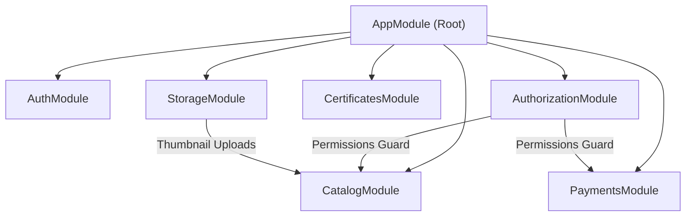
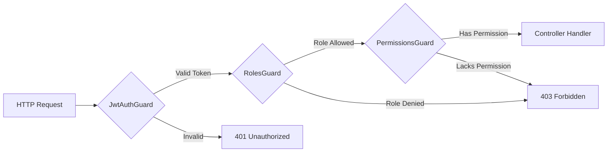

# Backend API Architecture Documentation (`apps/api`)

This document provides a technical specification of the backend application for the Joel Talargie Academy LMS. The backend is built as an enterprise NestJS 11 RESTful application utilizing **Drizzle ORM**, **Neon PostgreSQL**, **JWT Authentication**, **Role-Based Access Control (RBAC)**, **PDF Generation**, and **Asynchronous Worker Pipelines**.

---

## Table of Contents

- [1. Architecture Overview](#1-architecture-overview)
- [2. Module Architecture](#2-module-architecture)
- [3. Authentication & Security](#3-authentication--security)
- [4. Authorization & Permission System (RBAC)](#4-authorization--permission-system-rbac)
- [5. Core API Endpoints Reference](#5-core-api-endpoints-reference)
- [6. Payment & Financial Workflows](#6-payment--financial-workflows)
- [7. Certificate Issuance Engine](#7-certificate-issuance-engine)
- [8. Background Worker Pipelines](#8-background-worker-pipelines)
- [9. Swagger API Documentation & Testing](#9-swagger-api-documentation--testing)

---

## 1. Architecture Overview

The backend application is located in `apps/api`. It follows NestJS modular architecture, separating request handling (Controllers), business logic (Services), and database data access (Repositories):

```
apps/api/src/
├── common/                   # Global Interceptors, Filters, Pipes & Decorators
├── config/                   # Configuration Services & Env Schemas
├── infrastructure/           # Database Client Connection Providers
└── modules/
    ├── auth/                 # Authentication, JWT Tokens & Google OAuth
    ├── authorization/        # RBAC Context, Permission Guards & Catalog
    ├── catalog/              # Public & Admin Courses & Category Hierarchy
    ├── enrollments/          # Student Course Enrollments
    ├── learning/             # Progress Mechanics & Lesson Activity
    ├── payments/             # Manual Payment Approvals & Methods
    ├── promotions/           # Coupon Rules Engine & Discounts
    ├── certificates/         # PDF Generation & Token Verification
    ├── administration/       # System Settings Registry & CMS API
    ├── notifications/        # User Notifications & Email Transporter
    ├── storage/              # File Uploads, Image Resizing & Storage
    └── reports/              # Analytics, Audit Logs & CSV/XLSX Export
```

---

## 2. Module Architecture



---

## 3. Authentication & Security

### Authentication Mechanisms

1. **Local Authentication**: Email normalized lowercase & password checked via `bcrypt.compare()`. Passwords are encrypted with 12 salt rounds before database persistence.
2. **JWT Token Management**:
   - Access Token: Short-lived (`15m` TTL) signed JWT token stored in HTTP-only cookie or Authorization Bearer header.
   - Refresh Token: Long-lived (`7d` TTL) stored in encrypted HTTP-only cookie for seamless token refresh.
3. **Google OAuth 2.0 Integration**: Authenticates users via Google OAuth strategy, auto-provisioning new accounts with the default `STUDENT` role if unregistered.

---

## 4. Authorization & Permission System (RBAC)

Access control is enforced globally using NestJS Guards and custom reflection decorators:

### Guard Evaluation Pipeline



### Key Decorators

- `@Public()`: Bypasses authentication guards for public routes (e.g. landing page data, public course list).
- `@Roles('ADMINISTRATOR', 'INSTRUCTOR', 'STUDENT')`: Restricts endpoint execution to specified user role codes.
- `@RequirePermissions('courses.update', 'payments.approve')`: Enforces specific permission code requirements checked via `AuthorizationContextService`.

---

## 5. Core API Endpoints Reference

All API routes are prefixed with `/api/v1`:

| Method  | Endpoint Path                           | Roles / Protection                        | Purpose                                               |
| ------- | --------------------------------------- | ----------------------------------------- | ----------------------------------------------------- |
| `POST`  | `/auth/login`                           | Public                                    | Authenticate user and issue JWT cookies               |
| `POST`  | `/auth/register`                        | Public                                    | Register new student account                          |
| `GET`   | `/me/authorization`                     | Authenticated                             | Retrieve current user roles & permission codes        |
| `GET`   | `/public/landing`                       | Public                                    | Retrieve active Landing Page CMS dataset              |
| `GET`   | `/catalog/courses`                      | Public                                    | Search & filter active public courses                 |
| `GET`   | `/catalog/courses/:slug`                | Public                                    | Retrieve public course detail & lesson preview tree   |
| `GET`   | `/student/analytics/overview`           | Authenticated                             | Retrieve student learning KPIs and enrollment stats   |
| `POST`  | `/me/payments`                          | Authenticated                             | Submit manual bank transfer payment receipt           |
| `GET`   | `/admin/academics/courses`              | `ADMIN`, `INSTRUCTOR`                     | List & filter course catalog for management           |
| `POST`  | `/admin/academics/courses`              | `@RequirePermissions('courses.create')`   | Create new course entry                               |
| `GET`   | `/admin/financial/payments`             | `@RequirePermissions('payments.read')`    | List pending/approved/declined payment submissions    |
| `PATCH` | `/admin/financial/payments/:id/approve` | `@RequirePermissions('payments.approve')` | Approve manual payment and activate course enrollment |
| `PATCH` | `/admin/system/academy-settings`        | `@RequirePermissions('settings.update')`  | Batch update platform settings and CMS data           |

---

## 6. Payment & Financial Workflows

The payment system supports manual bank transfer verification workflows tailored for the primary target market:

1. **Submission**: Student selects a course, chooses bank transfer payment method, uploads receipt photo/document via `/storage/upload`, and submits transaction ID + exact amount.
2. **Validation**: The system verifies currency matching (**ETB** default) and flags exact decimal mismatches.
3. **Approval**: Administrator reviews proof image on `/admin/financial/payments`. Upon clicking **Approve**, the system:
   - Sets payment status to `APPROVED`.
   - Sets enrollment status to `ACTIVE`.
   - Emits payment approval audit log event.

---

## 7. Certificate Issuance Engine & Strict Lifecycle

1. **Eligibility Criteria**: When student progress reaches 100% completed lessons in an active course with `certificateEnabled = true`.
2. **Idempotent Record Creation**: Inserts certificate issuance job into `certificates` table with status `PENDING` (deduplicated by `enrollmentId`).
3. **Asynchronous PDF Generation & Validation**:
   - Background worker loads template configuration, formats student name, course title, completion date, certificate number, and verification URL into a PDF file via PDFKit.
   - Validates PDF output: verifies non-empty buffer (`size >= 100` bytes) and PDF header signature (`%PDF-`).
4. **Storage & Verification**:
   - Stores PDF file via `StorageService` to `certificates/{id}/v{version}/{uuid}.pdf`.
   - Performs storage verification write check (`StorageService.exists`).
   - Transactionally inserts `certificate_files` record and updates `certificates.status = 'GENERATED'` only after storage verification succeeds.
5. **Notification Timing**:
   - Emits `CERTIFICATE_READY` notification (In-App, Email, Telegram) **only after** `certificates.status` transitions to `GENERATED`.
6. **Public Verification**: Anyone can verify certificate authenticity at `/certificates/verify/:token`.

---

## 8. Background Worker Pipelines

Dedicated background workers can be launched independently in production for scalability:

```bash
# 1. Certificate Worker (Polls and processes pending certificate jobs)
npm run worker:certificates

# 2. Email Worker (Processes notification delivery queue and sends SMTP emails)
npm run worker:email

# 3. Reports Worker (Generates heavy background CSV/XLSX analytics exports)
npm run worker:reports
```

---

## 9. Swagger API Documentation & Testing

### Interactive Swagger UI

When the API server is running, interactive Swagger documentation is available at:
`http://localhost:4000/api/docs`

### Executing Tests

```bash
# Run NestJS API unit test suites
npm run test:api

# Execute with coverage report
npm run test:api -- --coverage
```
