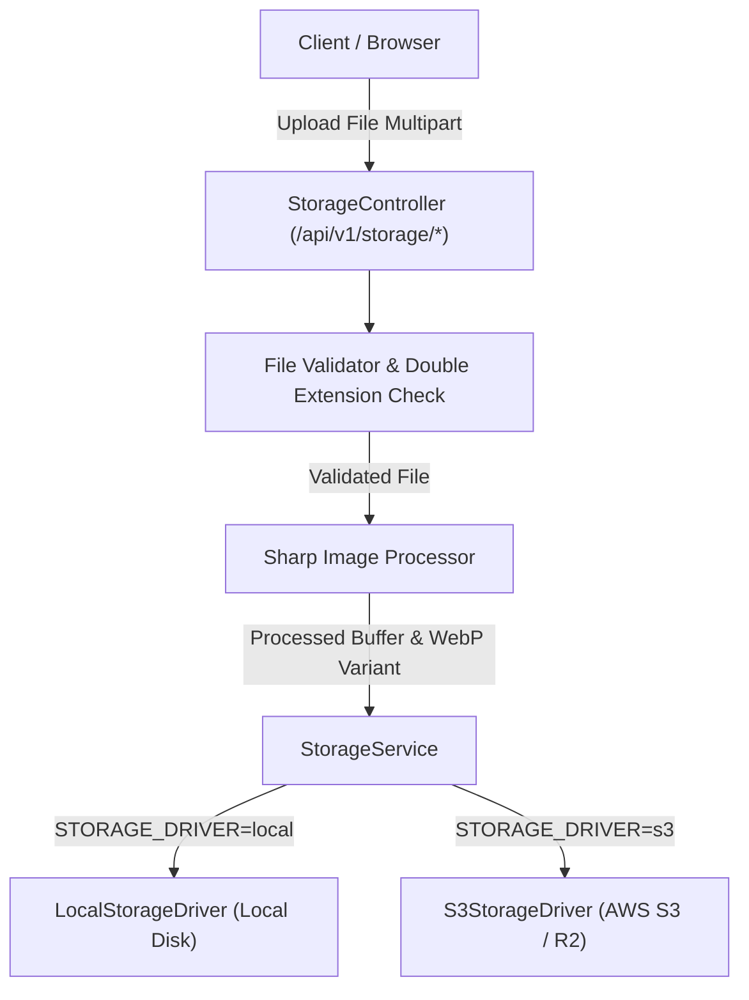

# File Management & Storage Architecture Documentation (`FILE-MANAGEMENT.md`)

This document provides a technical specification of the file management, storage abstraction, file upload validation, image processing, and asset serving subsystems in the Joel Talargie Academy LMS.

---

## Table of Contents

- [1. Subsystem Architecture](#1-subsystem-architecture)
- [2. Storage Drivers (`local` vs `s3`)](#2-storage-drivers-local-vs-s3)
- [3. Folder Categories & Storage Organization](#3-folder-categories--storage-organization)
- [4. File Security & Validation Pipeline](#4-file-security--validation-pipeline)
- [5. Cryptographic UUID Renaming](#5-cryptographic-uuid-renaming)
- [6. Image Processing & Variant Generation](#6-image-processing--variant-generation)
- [7. Signed Access Tokens & Asset Serving](#7-signed-access-tokens--asset-serving)
- [8. API Endpoints Reference](#8-api-endpoints-reference)

---

## 1. Subsystem Architecture

The storage subsystem resides in `apps/api/src/modules/storage`. It uses a polymorphic storage driver abstraction allowing seamless switching between local disk storage and cloud object storage without changing application code.



---

## 2. Storage Drivers (Local Storage Driver — Primary)

The system is configured to use the **Local Storage Driver (`STORAGE_DRIVER=local`)** as its primary active storage driver.

### 1. Local Storage Driver (`STORAGE_DRIVER=local`) — Active Default

- **Primary Driver**: Used by default across development and production VPS environments (Hostinger / Ubuntu).
- **Root Directory**: All uploaded files are stored directly on the server's local filesystem inside `storage/` located at the project root directory.
- **Subdirectory Structure**:
  - `storage/avatars/`: User profile photos & instructor pictures
  - `storage/course-thumbnails/`: Course banners & category preview graphics
  - `storage/lesson-resources/`: Downloadable attachments & code zip files
  - `storage/payment-receipts/`: Submitted bank transfer payment receipts
  - `storage/certificates/`: Generated PDF course completion certificates
- **Asset Serving**: Files are served directly via NestJS streaming responses through `/api/v1/storage/*` API controllers.

### 2. S3 Object Storage Driver (`STORAGE_DRIVER=s3`) — Optional Plugin

- **Optional Plugin**: Available as an alternative cloud driver for S3-compatible services (AWS S3, Cloudflare R2, DigitalOcean Spaces, MinIO) if remote cloud storage is configured in the future.
- **Configuration**: Activated by changing `STORAGE_DRIVER=s3` in environment configuration.

---

## 3. Folder Categories & Storage Organization

Assets are partitioned into isolated folder categories:

| Folder Category     | Target Directory             | Max File Size | Allowed Types       | Purpose                                         |
| ------------------- | ---------------------------- | ------------- | ------------------- | ----------------------------------------------- |
| `avatars`           | `storage/avatars/`           | 5 MB          | JPG, PNG, WebP      | User profile pictures & mentor spotlight photos |
| `course-thumbnails` | `storage/course-thumbnails/` | 10 MB         | JPG, PNG, WebP      | Course banner graphics & category card images   |
| `lesson-resources`  | `storage/lesson-resources/`  | 50 MB         | PDF, ZIP, TXT, DOCX | Downloadable exercise attachments & source code |
| `payment-receipts`  | `storage/payment-receipts/`  | 10 MB         | JPG, PNG, PDF       | Submitted bank transfer proof & receipt images  |
| `certificates`      | `storage/certificates/`      | 5 MB          | PDF                 | Generated PDF course completion certificates    |

### 5. Certificate PDF Storage & Access

- **Storage Key**: `certificates/{certificateId}/v{version}/{uuid}.pdf`
- **Validation**: Generated buffers are validated for non-zero size (`size >= 100` bytes) and PDF header signature (`%PDF-`).
- **Access Control**: Certificate PDF files are private assets. Downloads require student ownership or administrative authorization, served via signed URL or `/api/v1/certificates/:id/download`.

---

## 4. File Security & Validation Pipeline

Before any file is written to storage, it passes through a multi-stage security pipeline:

### 1. Filename Sanitization (`filename.util.ts`)

Original client filenames are stripped of path separators, shell escape characters, and control codes:

```typescript
export function sanitizeOriginalFileName(name: string): string {
  const base = name.split(/[/\\]/).pop() ?? name;
  const cleaned = base.replace(/[^A-Za-z0-9._-]/g, '_').slice(0, 150);
  return cleaned || 'file';
}
```

### 2. Double Extension Defense (`filename.util.ts`)

To prevent malicious double-extension execution exploits (e.g. `receipt.pdf.exe`), the validator detects extra dots in the filename:

```typescript
export function hasDoubleExtension(name: string, matchedExtension: string): boolean {
  const withoutMatched = name.slice(0, name.length - matchedExtension.length);
  return withoutMatched.includes('.');
}
```

---

## 5. Cryptographic UUID Renaming

To guarantee file uniqueness and eliminate overwrite risk when multiple users upload files with identical names (e.g. `avatar.jpg`), files are assigned a cryptographically random **UUID v4** filename:

```typescript
export function buildStoredFileName(extension: string): string {
  return `${randomUUID()}${extension}`;
}
```

**Example Stored File Path**:
`storage/course-thumbnails/a0646359-f028-48ce-ae6f-032ebd09c86c.png`

---

## 6. Image Processing & Variant Generation

All uploaded images (`avatars` and `course-thumbnails`) pass through **Sharp** image processing prior to disk/S3 write:

1. **Dimension Normalization**: Resizes avatars to 400x400 (square cover) and course thumbnails to 1280x720 (video inside).
2. **WebP Generation**: Creates an additional compressed WebP variant (`a0646359-f028-48ce-ae6f-032ebd09c86c.webp`) alongside the primary image for fast web delivery.
3. **SHA-256 Checksum**: Calculates the file's SHA-256 hash digest to detect duplicate uploads.

---

## 7. Signed Access Tokens & Asset Serving

Private files (e.g. payment receipts and downloadable resources) are protected by HMAC-SHA256 signed tokens:

```typescript
// Generates a time-bound signed URL token
const token = storageService.generateSignedToken({
  fileKey: 'payment-receipts/a0646359-f028-48ce-ae6f-032ebd09c86c.png',
  expiresInSeconds: 900, // 15 minutes TTL
});
```

**Public Access Route**:
`GET /api/v1/storage/signed/:token`
_The server verifies token HMAC signature and expiration before streaming the file content._

---

## 8. API Endpoints Reference

| Method | Endpoint Path                            | Protection                              | Description                                             |
| ------ | ---------------------------------------- | --------------------------------------- | ------------------------------------------------------- |
| `POST` | `/api/v1/storage/avatar`                 | Authenticated                           | Upload & process user avatar photo                      |
| `POST` | `/api/v1/storage/course-thumbnail`       | `@RequirePermissions('courses.update')` | Upload & process course banner image                    |
| `POST` | `/api/v1/storage/receipt`                | Authenticated                           | Upload bank transfer payment receipt image/PDF          |
| `POST` | `/api/v1/storage/upload`                 | Authenticated                           | Generic multipart upload with folder category parameter |
| `GET`  | `/api/v1/storage/avatar/:id`             | Public                                  | Stream user avatar image or WebP variant                |
| `GET`  | `/api/v1/storage/course-thumbnails/:key` | Public                                  | Stream course thumbnail graphic                         |
| `GET`  | `/api/v1/storage/signed/:token`          | Signed Token                            | Stream private file using time-bound HMAC token         |
