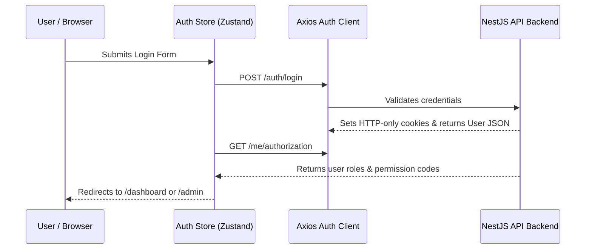

# Frontend Web Application Documentation (`apps/web`)

This document provides a comprehensive technical reference for the frontend web application of the Joel Talargie Academy LMS. The frontend is built using **Next.js 15 (App Router)**, **React 19**, **Tailwind CSS v4**, **TanStack React Query v5**, **Zustand**, and **TypeScript**.

---

## Table of Contents

- [1. Architecture Overview](#1-architecture-overview)
- [2. Directory & Route Sitemap](#2-directory--route-sitemap)
- [3. Authentication & State Management](#3-authentication--state-management)
- [4. API Client & Server Synchronization](#4-api-client--server-synchronization)
- [5. Feature Modules](#5-feature-modules)
- [6. UI Component & Design System](#6-ui-component--design-system)
- [7. Data Source Switch (`mock` vs `live`)](#7-data-source-switch-mock-vs-live)
- [8. Form Validation & Toast System](#8-form-validation--toast-system)
- [9. Testing & Environment Variables](#9-testing--environment-variables)

---

## 1. Architecture Overview

The frontend application resides in `apps/web` within the monorepo. It leverages Next.js 15 App Router with React Server Components (RSC) for marketing pages and Client Components for interactive portals.

```
apps/web/
├── src/
│   ├── app/                    # Next.js App Router Page Routes & Layouts
│   ├── components/             # Reusable UI Primitives & Layout Wrappers
│   ├── config/                 # Data Source & Application Configurations
│   ├── constants/              # Centralized Routes & Nav Menu Definitions
│   ├── features/               # Domain Feature Modules (Catalog, Payments, CMS, etc.)
│   ├── hooks/                  # Global Utility React Hooks
│   ├── lib/                    # API Clients, Formatters, and Utilities
│   └── stores/                 # Zustand Global State Stores (Auth Store)
```

---

## 2. Directory & Route Sitemap

The application uses Next.js Route Groups to organize layouts cleanly:

| Route Group | Base Path | Layout / Protection | Purpose |
|---|---|---|---|
| `(public)` | `/` | Public Layout (Navbar + Footer) | Marketing site, course catalog, category pages, instructor spotlight, about, pricing, FAQ |
| `auth` | `/auth/*` | Auth Layout (Centered Card) | Login (`/auth/login`), Registration (`/auth/register`), Password Reset (`/auth/forgot-password`) |
| `dashboard` | `/dashboard/*` | Protected Dashboard Layout (Sidebar + Header) | Student Portal: enrolled courses, lesson player, certificate downloads, payment history |
| `admin` | `/admin/*` | Protected Admin Layout (Admin Navigation + CMS Bar) | Management Portal: user management, course authoring, category management, financial approvals, CMS |

### Key Page Routes Table

| Route Path | Page Purpose | Component Type |
|---|---|---|
| `/` | Landing page driven by Admin CMS settings | Server Component (SSR) |
| `/courses` | Searchable public course catalog | Server Component + Client Filter |
| `/courses/[slug]` | Course detail page with curriculum & instructor info | Server Component (SSR) |
| `/categories` | Active category grid exploration | Server Component (SSR) |
| `/categories/[slug]` | Category detail page with published courses | Server Component (SSR) |
| `/certificates/verify/[token]` | Public certificate verification lookup | Server Component (SSR) |
| `/auth/login` | Email/password & Google OAuth login form | Client Component |
| `/dashboard` | Student learning overview & active enrollment cards | Client Component |
| `/dashboard/courses/[enrollmentId]/learn` | Interactive multi-section lesson & video player | Client Component |
| `/dashboard/payments` | Student payment submission & receipt status | Client Component |
| `/admin/academics/courses` | Course catalog authoring & curriculum builder | Client Component |
| `/admin/financial/payments` | Bank transfer payment review & approval table | Client Component |
| `/admin/system/academy-settings` | Platform settings & Landing CMS Manager | Client Component |

---

## 3. Authentication & State Management

### Zustand Global Auth Store (`apps/web/src/stores/auth.store.ts`)
The authentication state is managed globally using Zustand and persisted in browser storage:

```typescript
interface AuthState {
  user: User | null;
  authorization: UserAuthorizationContext | null;
  isAuthenticated: boolean;
  status: 'idle' | 'loading' | 'authenticated' | 'unauthenticated';
  login: (credentials: LoginInput) => Promise<void>;
  logout: () => Promise<void>;
  fetchAuthorization: () => Promise<void>;
}
```

### Authentication Lifecycle Flow


---

## 4. API Client & Server Synchronization

### Axios Client Configuration (`apps/web/src/lib/api/auth-client.ts`)
API communications use a centralized Axios instance configured with environment-aware base URL resolution:

```typescript
export const getApiBaseUrl = () => {
  if (typeof window !== 'undefined') {
    return '/api/v1'; // Browser requests proxy through Next.js rewrite
  }
  const raw = process.env.INTERNAL_API_URL || process.env.NEXT_PUBLIC_API_URL || 'http://localhost:4000/api/v1';
  return normalizeBaseUrl(raw) ?? 'http://localhost:4000/api/v1';
};
```

### Interceptor Handlers
- **401 Unauthorized**: Automatically clears auth state and redirects users to `/auth/login` if browsing protected routes.
- **403 Forbidden**: Displays an error toast (*"Access denied: You don't have permission to do that."*) for mutation operations (`POST`, `PUT`, `PATCH`, `DELETE`).

---

## 5. Feature Modules

Code is organized into feature domains under `src/features/*`:

```
src/features/
├── account/                  # User profile, security, and password update forms
├── catalog/                  # Course cards, curriculum trees, category grid, filtering hooks
├── checkout/                 # Course enrollment flow, payment method selection, promo apply
├── dashboard/                # Student dashboard widgets and progress cards
├── learning/                 # Lesson player, video embed, completion checkboxes
├── payments/                 # Manual payment receipt submission and admin verification table
├── promotions/               # Promo code validation and discount preview
├── reports/                  # Admin reporting, charts, CSV/XLSX export triggers
└── settings/                 # Platform settings manager and Landing Page CMS form tabs
```

---

## 6. UI Component & Design System

The UI design system relies on **Tailwind CSS v4** and customized Shadcn-style components:

- **Color System**: Custom HSL CSS tokens defined in `src/app/globals.css` supporting dark mode (`.dark`).
- **Typography**: Clean, readable hierarchy with Inter font styling and line-clamp utilities.
- **Card Variants**: Glassmorphic cards (`bg-card/50 backdrop-blur-md border-border`) with subtle hover transitions.
- **Feedback & Loading**: Dynamic skeleton placeholders (`<Skeleton />`), spinners (`<Loader2 />`), and empty state indicators (`<EmptyState />`).

---

## 7. Data Source Switch (`mock` vs `live`)

The catalog and learning features support dual data sources defined in `src/config/data-source.config.ts`:

```typescript
export type CatalogDataSource = 'mock' | 'live';
export const CATALOG_DATA_SOURCE: CatalogDataSource =
  (process.env.NEXT_PUBLIC_CATALOG_DATA_SOURCE as CatalogDataSource | undefined) ?? 'live';
```

- **Live Mode (`live`)**: Default production mode. Talks directly to the NestJS API backend (`/api/v1/*`).
- **Mock Mode (`mock`)**: Switches API clients to local mock dataset fixtures (`mock-courses.data.ts`, `mock-instructors.data.ts`, etc.) for offline frontend testing.

---

## 8. Form Validation & Toast System

- **Form Validation**: Form state and input validations use **React Hook Form** paired with **Zod** schema validators.
- **Toast Notifications**: Built-in toast system ([toast.ts](file:///c:/Users/HP/Desktop/Work-Project/JoelAcademy/apps/web/src/lib/toast.ts)) powered by `sonner` providing success, error, info, and warning alerts.

---

## 9. Testing & Environment Variables

### Environment Variables (`apps/web/.env.example`)
```env
NEXT_PUBLIC_API_URL=http://localhost:4000/api/v1
NEXT_PUBLIC_SITE_URL=http://localhost:3000
NEXT_PUBLIC_CATALOG_DATA_SOURCE=live
INTERNAL_API_URL=http://localhost:4000/api/v1
```

### Commands
- **Launch Frontend Dev Server**: `npm run dev:web`
- **TypeScript Typecheck**: `npm run typecheck` (or `npx tsc --noEmit` inside `apps/web`)
- **Unit Tests**: `npm run test:web` (runs Vitest test suites)
