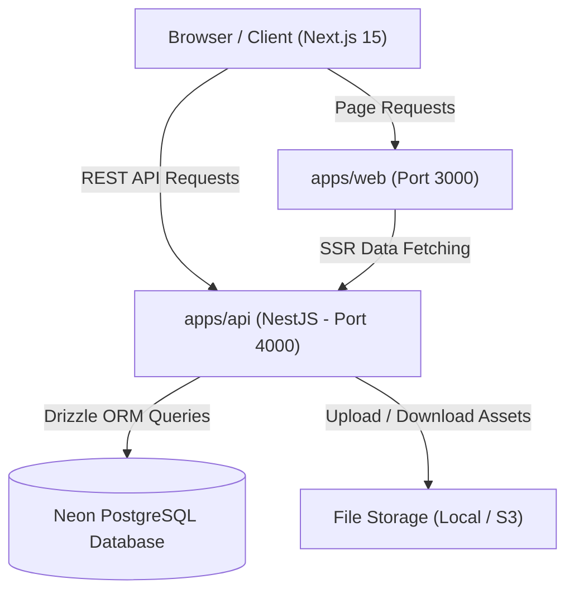

# Joel Talargie Academy LMS — Master Documentation

Welcome to the official technical documentation for **Joel Talargie Academy Learning Management System (LMS)**. This repository is structured as a production-grade npm workspace monorepo containing a **Next.js 15 App Router frontend**, a **NestJS RESTful API backend**, a **Drizzle ORM & Neon PostgreSQL database tier**, and shared type contracts.

---

## Table of Contents

- [1. System Overview](#1-system-overview)
- [2. Monorepo Structure](#2-monorepo-structure)
- [3. Technology Stack](#3-technology-stack)
- [4. Quick Start & Prerequisites](#4-quick-start--prerequisites)
- [5. System Architecture & Workflows](#5-system-architecture--workflows)
- [6. Package & Application Sitemap](#6-package--application-sitemap)
- [7. Script Reference](#7-script-reference)
- [8. Security & RBAC Overview](#8-security--rbac-overview)
- [9. Documentation Sitemap](#9-documentation-sitemap)

---

## 1. System Overview

Joel Talargie Academy LMS is a complete enterprise learning and course delivery platform engineered for high-performance course distribution, student progress tracking, financial management, automated certificate issuance, and administrative content management.

### Key Capabilities

- **Public Marketing & Catalog**: Dynamic landing page driven by administrative CMS, course discovery (`/courses`), category exploration (`/categories`), and instructor spotlight.
- **Student Learning Portal**: Interactive course enrollment, multi-section video/article lesson player, quiz/assignment tracking, progress persistence, and payment histories.
- **Administrative Control Workspace**: Comprehensive course authoring, category hierarchy management, student enrollment management, manual bank transfer payment approval workflows, promo code engine, user role/permissions management, platform settings configuration, and audit logging.
- **Automated Certificate Engine**: Automated PDF generation upon 100% course completion, private versioned PDF storage, asynchronous background worker jobs, and public verification lookup (`/certificates/verify/:token`).
- **Financial & Payment Workflows**: Multi-currency support (defaulting to **ETB**), manual bank transfer receipt upload, approval/rejection audit trail, exact amount validation, and coupon discount calculations.
- **Asynchronous Worker Pipelines**: Background worker scripts for notification processing (`worker:email`), certificate generation (`worker:certificates`), and reporting exports (`worker:reports`).

---

## 2. Monorepo Structure

The repository uses `npm` workspaces to manage application and package boundaries cleanly:

```
JoelAcademy/
├── README.md                   # System Master Documentation (This file)
├── FRONTEND.md                 # Frontend Architecture & Next.js App Router Guide
├── BACKEND.md                  # Backend API, NestJS Modules & Services Guide
├── DATABASE.md                 # Database Architecture, Drizzle Schema & Migrations
├── DEPLOYMENT.md               # Production Deployment, VPS, PM2 & Nginx Guide
├── FILE-MANAGEMENT.md          # File Storage, Uploads, UUID & Security Guide
│
├── apps/
│   ├── web/                    # Next.js 15 Frontend Web Application (Port 3000)
│   └── api/                    # NestJS RESTful API Backend Application (Port 4000)
│
├── packages/
│   ├── contracts/              # Shared Zod Schemas & DTO Types
│   ├── database/               # Drizzle ORM Schema, Neon Client & Migrations
│   ├── config/                 # Shared TypeScript & ESLint Configurations
│   └── ui/                     # Shared UI Components (Future boundary)
│
├── docs/                       # Architectural Reference Specifications
├── storage/                    # Local File Upload Root (Local Storage Driver)
└── package.json                # Monorepo Workspace Configuration & Scripts
```

---

## 3. Technology Stack

| Layer                     | Technology                     | Version    | Purpose                                          |
| ------------------------- | ------------------------------ | ---------- | ------------------------------------------------ |
| **Frontend Framework**    | Next.js (App Router)           | `^15.2.3`  | React Server Components & Client SPA pages       |
| **UI Library**            | React                          | `^19.0.0`  | UI Component Rendering Engine                    |
| **Styling & Icons**       | Tailwind CSS v4 / Lucide       | `^4.0.12`  | Modern styling, utility classes, and iconography |
| **State & Data Fetching** | TanStack React Query / Zustand | `^5.67.2`  | Server state caching & global client auth store  |
| **Backend Framework**     | NestJS                         | `^11.0.10` | Enterprise RESTful API backend architecture      |
| **Database ORM**          | Drizzle ORM                    | `^0.40.0`  | Type-safe SQL query builder and migrations       |
| **Database Server**       | PostgreSQL (Neon / Local)      | `>=15`     | Serverless pooled & direct relational database   |
| **Authentication**        | JWT & Passport & Google OAuth  | `^11.0.0`  | Token auth, HTTP-only cookies, Google OAuth 2.0  |
| **Password Hashing**      | bcrypt                         | `^6.0.0`   | One-way password hashing (12 rounds)             |
| **Validation**            | class-validator & Zod          | `^0.14.1`  | DTO request validation & type contracts          |
| **Image Processing**      | Sharp                          | `^0.33.5`  | Thumbnail resizing & WebP variant conversion     |
| **Language & Tooling**    | TypeScript                     | `^5.8.3`   | Strict static typing across entire codebase      |

---

## 4. Quick Start & Prerequisites

### Prerequisites

- **Node.js**: Version `24.x` (enforced via `.nvmrc` and `engines`)
- **npm**: Version `11.x`
- **PostgreSQL Database**: Neon serverless instance or local PostgreSQL instance

### Local Development Setup

1. **Clone Repository and Install Dependencies**:

   ```bash
   git clone https://github.com/DigitalConstructGO/joel-talargie-academy-lms.git
   cd joel-talargie-academy-lms
   npm install
   ```

2. **Configure Environment Variables**:
   Copy `.env.example` to root `.env`, `apps/web/.env.local`, and `apps/api/.env`:

   ```bash
   cp .env.example .env
   cp apps/web/.env.example apps/web/.env.local
   cp apps/api/.env.example apps/api/.env
   ```

3. **Run Database Migrations & Seed**:

   ```bash
   npm run db:migrate
   npm run db:seed
   ```

4. **Launch Local Development Servers**:
   ```bash
   npm run dev
   ```
   - **Frontend Application**: `http://localhost:3000`
   - **Backend API Application**: `http://localhost:4000/api/v1`
   - **Swagger API Documentation**: `http://localhost:4000/api/docs`

---

## 5. System Architecture & Workflows



### Core Business Workflows

1. **Authentication Flow**: User registers or logs in → API issues JWT HTTP-only cookies & access tokens → `useAuthStore` fetches authorization context (`/me/authorization`) → App routes dynamically based on role (`STUDENT`, `INSTRUCTOR`, `ADMINISTRATOR`).
2. **Checkout & Payment Flow**: Student selects course → Enters promo code (optional) → Submits manual bank payment receipt image → Payment record created with `PENDING` status → Admin reviews proof in Admin Panel → Upon approval, enrollment status changes to `ACTIVE`.
3. **Learning & Progress Flow**: Student accesses `/dashboard/courses/:id/learn` → Selects lessons → Progress auto-saved to backend → Upon 100% completion, certificate generation job triggers automatically.

---

## 6. Package & Application Sitemap

```
apps/web/src/app/
├── (public)/                 # Public pages (Home, Courses, Categories, Instructors, About)
├── auth/                     # Authentication (Login, Register, Forgot Password)
├── dashboard/                # Student Dashboard (My Courses, Browse, Certificates, Payments)
└── admin/                    # Admin Dashboard (Users, Academics, Financials, System, CMS)
```

```
apps/api/src/modules/
├── auth/                     # Authentication & OAuth
├── authorization/            # Permission Guard & RBAC System
├── catalog/                  # Courses & Categories REST Controllers
├── enrollments/              # Course Enrollments
├── learning/                 # Student Progress & Learning Mechanics
├── payments/                 # Manual Payment Approval & Payment Methods
├── promotions/               # Promo Codes & Discounts
├── certificates/             # Certificate Generation & Verification
├── notifications/            # Email Templates & Delivery Worker
├── storage/                  # File Storage, Image Optimization & Uploads
├── administration/           # Platform Settings & Landing CMS API
└── reports/                  # Analytics, Audit Logs & Data Export
```

---

## 7. Script Reference

All standard commands are executed from the monorepo root:

| Command                       | Purpose                                                               |
| ----------------------------- | --------------------------------------------------------------------- |
| `npm run dev`                 | Runs both `apps/web` (3000) and `apps/api` (4000) concurrently        |
| `npm run build`               | Builds production bundles for all workspace apps and packages         |
| `npm run typecheck`           | Runs TypeScript `--noEmit` typecheck across all workspaces            |
| `npm run lint`                | Runs ESLint across all workspaces                                     |
| `npm test`                    | Executes unit and integration test suites                             |
| `npm run db:generate`         | Generates new Drizzle migration files based on schema changes         |
| `npm run db:migrate`          | Applies pending Drizzle database migrations                           |
| `npm run db:seed`             | Seeds database with system roles, admin user, categories, and courses |
| `npm run db:studio`           | Launches Drizzle Studio GUI for visual database management            |
| `npm run worker:email`        | Launches background email notification delivery worker                |
| `npm run worker:certificates` | Launches background certificate generation worker                     |
| `npm run worker:reports`      | Launches background reporting & export generation worker              |

---

## 8. Security & RBAC Overview

- **Authentication**: JWT access & refresh tokens stored in secure, `SameSite=Lax` HTTP-only cookies and Authorization Bearer headers. Password verification uses `bcrypt` with 12 salt rounds.
- **Authorization Guard**: API routes are protected by `@Roles(...)` and `@RequirePermissions(...)` decorators. Access control decisions are evaluated against user roles and assigned permission codes resolved via `AuthorizationContextService`.
- **Database Security**: Direct SQL queries use Drizzle ORM parameterized inputs, eliminating SQL injection. Database credentials are server-only.
- **File Upload Security**: All uploaded files are validated for size and MIME-type, double-extension attempts are rejected (`receipt.pdf.exe`), and filenames are rewritten to random **UUID v4** strings before disk/S3 write.

---

## 9. Documentation Sitemap

For detailed technical guides on specific subsystems, consult the following documentation files located in the repository root:

- 🎨 **[FRONTEND.md](file:///c:/Users/HP/Desktop/Work-Project/JoelAcademy/FRONTEND.md)** — Frontend Next.js 15 App Router, React Query, Zustand, and UI components.
- ⚙️ **[BACKEND.md](file:///c:/Users/HP/Desktop/Work-Project/JoelAcademy/BACKEND.md)** — Backend NestJS REST API, modules, RBAC guards, services, and workers.
- 🗄️ **[DATABASE.md](file:///c:/Users/HP/Desktop/Work-Project/JoelAcademy/DATABASE.md)** — Database Drizzle ORM schema, Neon PostgreSQL setup, tables, and migrations.
- 🚀 **[DEPLOYMENT.md](file:///c:/Users/HP/Desktop/Work-Project/JoelAcademy/DEPLOYMENT.md)** — Production deployment guide for Hostinger VPS, PM2, Nginx, Vercel, and Render.
- 📁 **[FILE-MANAGEMENT.md](file:///c:/Users/HP/Desktop/Work-Project/JoelAcademy/FILE-MANAGEMENT.md)** — File upload architecture, storage drivers (Local/S3), UUID v4 security, and image processing.
